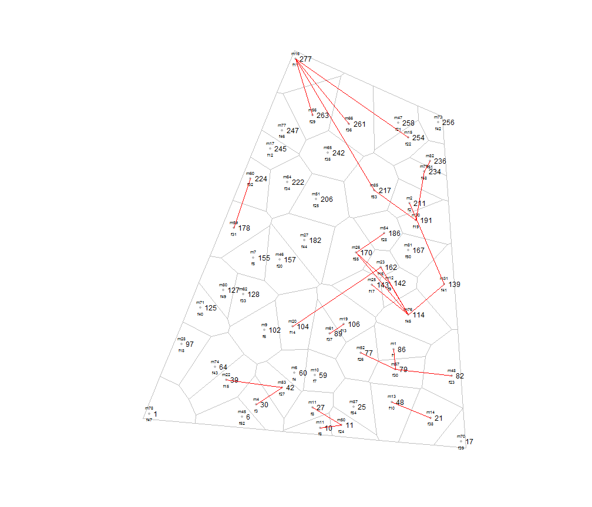
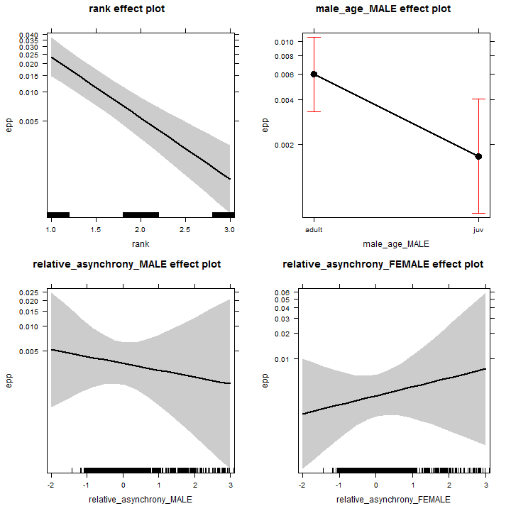

<!--
%\VignetteEngine{knitr::docco_linear}
%\VignetteIndexEntry{An Introduction to expp}
-->


# Instructions for the usage of the package expp


**Supplement to "Spatial patterns of extra-pair paternity: beyond paternity gains and losses"**"

**For latest version see vignette('expp')**

## 1. Download R version R 3.0.2, for example from [cran.studio.com] (http://cran.rstudio.com/).

## 2. Open R, and install package expp from the repository "R-Forge", or copy the following line of code into your R console:  
`install.packages("expp", repos = 'http://rforge.net')`
  
## 3. Load package.


  

```r
require(expp)
```

```
## Loading required package: expp
## ---------------------------------------------------------------------------------------
## This is expp 1.0
## For a detailed step-by-step example type vignette('expp')
## ---------------------------------------------------------------------------------------
```


## 4. Load raw datasets
"Westerholz" is a mixed-deciduous oak forest close to Landsberg am Lech, Germany (48°08' N 10°53' E). The woodland of ca. 40 ha contains 277 nestboxes since 2007, which are used to investigate the breeding biology and the mating system of blue tits.


```r
data(westerholzBreeding)
data(westerholzEPP)

head(westerholzBreeding, 2)
```

```
##   year_  id       x       y layingDate male_age female_age female male
## 1  2009 277 4417476 5335000         99    adult      adult    f11  m16
## 2  2009  82 4417816 5334307        106    adult      adult    f23  m48
```

```r
head(westerholzEPP, 2)
```

```
##   year_ female male
## 1  2009    f29  m16
## 2  2009    f53  m16
```

  
## 5. Select individual years using `split()`

```r
b = split(westerholzBreeding, westerholzBreeding$year_)
e = split(westerholzEPP, westerholzEPP$year_)
```


## 6. Prepare data


```r
breedingDat = lapply(b, SpatialPointsBreeding, coords = ~x + y, id = "id", breeding = ~male + 
    female)
polygonsDat = lapply(breedingDat, DirichletPolygons)
eppDat = lapply(e, eppMatrix, pairs = ~male + female)
```

  
## 7. The `epp()` function compiles an object of `class epp` from the input 'breedingDat', 'polygonsDat', and 'eppDat'. The `epp-object` contains the final datset and all input data, and can now be created.

```r
d = list()
for (i in 1:length(breedingDat)) {
    d[[i]] = epp(breedingDat[[i]], polygonsDat[[i]], eppDat[[i]], rank = 3)
}
```

  
## 8. We can then plot the data of each year. The package supplies two different types of plots for `class epp` (output of function `epp()`  ).  
#### A. plot() will plot the study area, the territory borders, and the EPP (as red lines).

```r
plot(d[[1]])
```

 

#### B. barplot() will by default plot the number of EPP events for each breeding distance. 

```r
barplot(d[[1]])
```

 

With the setting "relativeValues = TRUE" the proportion of EPP events within each breeding distance are plotted, and the proportion of available mates within each breeding distance is added as a dashed line. The maximal distance that is plotted depends on the setting of "rank" in step 7.

```r
barplot(d[[1]], relativeValues = TRUE)
```

 


## 9. Combine data of the two years and clean data.

```r
dat = lapply(d, as.data.frame)
dat = do.call(rbind, dat)

names(dat)[which(names(dat) == "year__FEMALE")] = "year_"
dat$year__MALE <- NULL

head(dat)
```

```
##   id_FEMALE id_MALE rank male female epp layingDate_MALE male_age_MALE
## 1        48      86    2   m1    f10   0             102           juv
## 2       106      86    1   m1    f13   0             102           juv
## 3       104      86    2   m1    f14   0             102           juv
## 4       162      86    3   m1    f16   0             102           juv
## 5       143      86    2   m1    f17   0             102           juv
## 6       191      86    3   m1    f19   0             102           juv
##   female_age_MALE id.1_MALE year_ layingDate_FEMALE male_age_FEMALE
## 1           adult        86  2009               100           adult
## 2           adult        86  2009               100           adult
## 3           adult        86  2009               105             juv
## 4           adult        86  2009               102           adult
## 5           adult        86  2009               100             juv
## 6           adult        86  2009               101           adult
##   female_age_FEMALE id.1_FEMALE
## 1             adult          48
## 2             adult         106
## 3             adult         104
## 4             adult         162
## 5             adult         143
## 6             adult         191
```


## 10. We now have two data sets. "d" lists the output of the function epp() for the two years, including the input data. "dat" contains the combined data of the two seasons excluding the input data.
  
## 11. Since EPP is most frequent among direct neighbours, estimates for all other variable are most meaningful if they are assessed for direct neighbours. We therefore subtract '1' from the breeding distance, so that direct neighbours get scored as '0'. 
This transformation is important for the calculation of the intercept and if interactions are modelled.

```r
if (min(dat$rank == 1)) dat$rank = dat$rank - 1
```


## 12. As a next step, variables can be transformed to be relative to the surroundings of the males or the females. We here present breeding asynchrony as an example. 
Note that centering is performed within the respective surroundings whereas scaling is performed populationwide.

```r
center = function(x) {
    return(x - mean(x, na.rm = TRUE))
}
scale2 = function(x) {
    return(x/(2 * sd(x, na.rm = TRUE)))
}

# laying dates -> asynchrony
dat$asynchrony = abs(dat$layingDate_MALE - dat$layingDate_FEMALE)

# asynchrony -> relative asynchrony within the breeding distance of the
# focal pair
MALE_splitBy = paste(dat$year_, dat$id_MALE, dat$male, dat$rank, sep = "_")
dat$relative_asynchrony_MALE = unsplit(lapply(split(dat$asynchrony, MALE_splitBy), 
    center), MALE_splitBy)
dat$relative_asynchrony_MALE = scale2(dat$relative_asynchrony_MALE)

FEMALE_splitBy = paste(dat$year_, dat$id_FEMALE, dat$female, dat$rank, sep = "_")
dat$relative_asynchrony_FEMALE = unsplit(lapply(split(dat$asynchrony, FEMALE_splitBy), 
    center), FEMALE_splitBy)
dat$relative_asynchrony_FEMALE = scale2(dat$relative_asynchrony_FEMALE)
```


## 13. We can now make sure the sample size is sufficient for the number of variables we aim to include into the model.

```r
table(dat$epp, dat$year_)  #sample size as the number of '0' and '1' in the epp column; '0' = no EPP; '1' = EPP;
```

```
##    
##     2009 2010
##   0 1385 2601
##   1   27   29
```

  
## 14. And finally, we can run the model (this may take a while depending on your system!).

```r
require(lme4)

fm = glmer(epp ~ rank + male_age_MALE + relative_asynchrony_MALE + relative_asynchrony_FEMALE + 
    (1 | male) + (1 | female) + (1 | year_), data = dat, family = binomial)
summary(fm)
```

```
## Generalized linear mixed model fit by maximum likelihood ['glmerMod']
##  Family: binomial ( logit )
## Formula: epp ~ rank + male_age_MALE + relative_asynchrony_MALE + relative_asynchrony_FEMALE +      (1 | male) + (1 | female) + (1 | year_) 
##    Data: dat 
## 
##      AIC      BIC   logLik deviance 
##    516.9    567.3   -250.4    500.9 
## 
## Random effects:
##  Groups Name        Variance Std.Dev.
##  male   (Intercept) 1.24e+00 1.11238 
##  female (Intercept) 1.19e-01 0.34503 
##  year_  (Intercept) 1.49e-05 0.00386 
## Number of obs: 4042, groups: male, 119; female, 117; year_, 2
## 
## Fixed effects:
##                            Estimate Std. Error z value Pr(>|z|)    
## (Intercept)                  -1.710      0.410   -4.17  3.1e-05 ***
## rank                         -1.499      0.234   -6.41  1.5e-10 ***
## male_age_MALEjuv             -1.293      0.463   -2.79   0.0052 ** 
## relative_asynchrony_MALE     -0.189      0.381   -0.50   0.6204    
## relative_asynchrony_FEMALE    0.249      0.354    0.70   0.4810    
## ---
## Signif. codes:  0 '***' 0.001 '**' 0.01 '*' 0.05 '.' 0.1 ' ' 1
## 
## Correlation of Fixed Effects:
##             (Intr) rank   m__MAL r__MAL
## rank        -0.827                     
## ml_g_MALEjv -0.255  0.011              
## rltv_s_MALE  0.021  0.012  0.004       
## rlt__FEMALE -0.019 -0.006 -0.035 -0.314
```

  
## 15. Finally, you can plot the model output using for example the R package "effects".

```r
require(effects)
plot(allEffects(fm))
```

 


