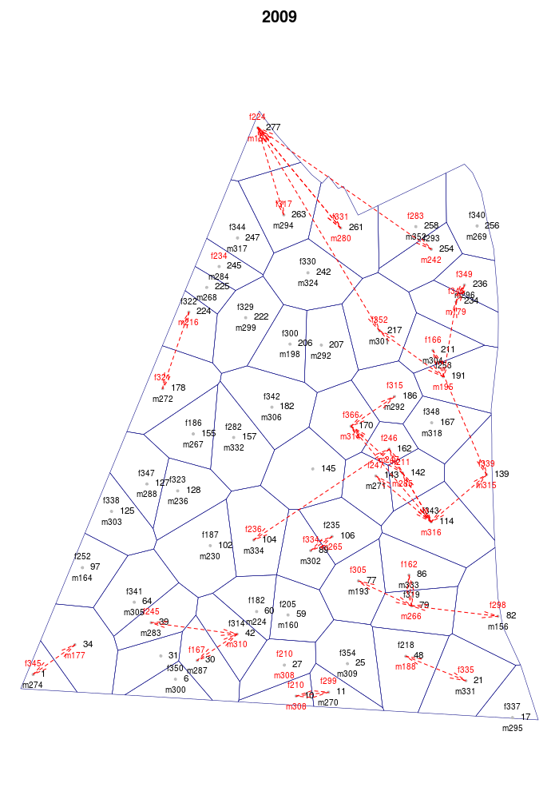
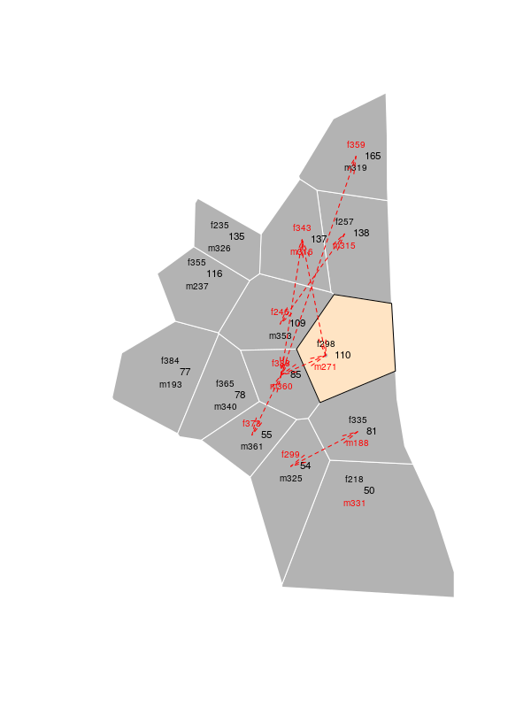

<!--
%\VignetteEngine{knitr::knitr}
%\VignetteIndexEntry{Blue Tits Case study}
-->

### Extra-pair paternity in Blue Tits (_Cyanistes caeruleus_): a case study from Westerholz, Bavaria, Germany

#### Supplement to Schlicht, Valcu and Kempenaers _"Spatial patterns of extra-pair paternity: beyond paternity gains and losses"_ (in prep.)


##### 1. Getting started
 * Download and install [R](https://cran.rstudio.com/).
 * Open R, and install _expp_ with:  

```r
install.packages("expp")
```
  

 * To load _expp_ type:   

```r
require(expp)
```

##### 2. Load datasets
For info on the data-sets type: 

```r
help(bluetit_breeding)
help(bluetit_epp)
help(bluetit_boundary)
```


```r
data(bluetit_breeding)
head(bluetit_breeding[bluetit_breeding$year_ == 2011, ])
```

    year_  id       x       y female male layingDate male_age male_tarsus
351  2011  17 4417837 5334163   <NA> <NA>        102    adult          NA
352  2011 160 4417574 5334549   <NA> m383        103      juv      17.160
353  2011 261 4417593 5334857   f174 m348        101    adult      17.045
354  2011 174 4417433 5334600   f186 m238        103    adult      16.800
355  2011  80 4417728 5334311   f218 m361        101    adult      17.500
356  2011 262 4417552 5334861   f224 m280         99    adult      17.110
    study_area
351 Westerholz
352 Westerholz
353 Westerholz
354 Westerholz
355 Westerholz
356 Westerholz


```r
data(bluetit_epp)
head(bluetit_epp[bluetit_epp$year_ == 2011, ])
```


|    | year_|male |female |
|:---|-----:|:----|:------|
|130 |  2011|m280 |f174   |
|163 |  2011|m376 |f224   |
|181 |  2011|m374 |f251   |
|190 |  2011|m328 |f266   |
|193 |  2011|m355 |f275   |
|194 |  2011|m310 |f277   |


```r
data(bluetit_boundary)
summary(bluetit_boundary)
```

```
## Object of class SpatialPolygonsDataFrame
## Coordinates:
##       min     max
## x 4417139 4815230
## y 5334160 5351921
## Is projected: TRUE 
## proj4string :
## [+proj=tmerc +lat_0=0 +lon_0=12 +k=1 +x_0=4500000 +y_0=0
## +datum=potsdam +units=m +no_defs +ellps=bessel
## +towgs84=598.1,73.7,418.2,0.202,0.045,-2.455,6.7]
## Data attributes:
##      year_     
##  Min.   :1998  
##  1st Qu.:2001  
##  Median :2004  
##  Mean   :2004  
##  3rd Qu.:2008  
##  Max.   :2011
```

##### 3. Prepare data

###### 3.1 Split by year (each year needs to be processed separately)


```r
b = split(bluetit_breeding, bluetit_breeding$year_)
e = split(bluetit_epp, bluetit_epp$year_) 

# sample sizes by year

# number of breeding pairs
sapply(b, nrow)
```

```
## 1998 1999 2000 2001 2002 2003 2004 2007 2008 2009 2010 2011 
##   52   67   82   78  114  105  100   88   97   61  102   79
```

```r
# number of extra-pair events
sapply(e, nrow)
```

```
## 1998 1999 2000 2001 2002 2003 2004 2007 2008 2009 2010 2011 
##   17   38   33   41   54   50   36   29   27   33   34   33
```

```r
# For the sake of conciseness only two years are used in the folowing analyses
b = b[c("2009", "2010")]
e = e[c("2009", "2010")]
p = bluetit_boundary[bluetit_boundary$year_ %in% c("2009", "2010"), ]
```

###### 3.2 Run a couple of helper functions on both breeding data and extra-pair paternity data 

```r
breedingDat = lapply(b, SpatialPointsBreeding, coords= ~x+y, id='id', breeding= ~male + female, 
  proj4string = CRS(proj4string(p)))

eppDat = lapply(e, eppMatrix, pairs = ~ male + female)
```

###### 3.3. Compute Dirichlet polygons based on the `SpatialPointsBreeding` object


```r
polygonsDat = mapply(DirichletPolygons, x = breedingDat, boundary = split(p, p$year_)) 
```
********************************************************************************

##### 4. All the objects are now ready to be processed by the `epp` function.

```r
maxlag = 10
eppOut = mapply(FUN = epp, breedingDat, polygonsDat, eppDat, maxlag)
```


```r
op = par(mar = c(0,0,2,0))

for(year in c("2009", "2010") ) { 
  plot(eppOut[[year]], cex = 0.7, lwd = .5, border = "navy" )
  title(main = year)
  }
```


###### Select one nest-box of a given year and zoom in.

```r
year = '2010'
box = 110
eppOut10 = eppOut[[year]]
plot(eppOut10 , zoom = box, maxlag = 2,cex = .7,  border = 'white', col = 'grey70', zoom.col = "bisque")
```



```r
par(op)
```


```r
op = par(mfrow = c(1,2))
    
#barplot(eppOut[[1]],relativeValues = TRUE, main = 2009) 
#legend(x="topright", legend = c('Observed', 'Potential'), lty = c(1, 2),bty='n')
#barplot(eppOut[[2]], relativeValues = TRUE, main = 2010)

par(op)
```

##### 5. Fitting a _glmm_ 

###### 5.1 Convert `eppOut` (a list of 2 _epp_ objects) into a `data.frame`.

```r
dat = lapply(eppOut, as.data.frame) # a list of data.frame(s)
dat = do.call(rbind, dat)
dat$year_ = dat$year__MALE; dat$year__FEMALE = NULL
```

###### 5.2. Data transformations prior to modelling.

####### Rescale rank; rank 1 becames rank 0

```r
dat$rank = dat$rank - min(dat$rank)
table(dat$rank)
```

```
## 
##    0    1    2    3    4    5    6    7    8    9 
##  824 1490 1970 2162 2128 1812 1430  958  592  328
```
####### Center and re-scale breeding asynchrony (i.e. the difference in laying data between male and female) within each rank.


```r
center = function(x) { return(x - mean(x, na.rm = TRUE)) }
scale2 = function(x) { return(x/(2*sd(x, na.rm = TRUE))) }

# Compute asynchrony
dat$asynchrony = abs(dat$layingDate_MALE - dat$layingDate_FEMALE)

#a Compute relative within-rank asynchrony
MALE_splitBy = paste(dat$year_, dat$id_MALE, dat$male, dat$rank, sep = "_")
dat$relative_asynchrony_MALE = unsplit(lapply(split(dat$asynchrony, MALE_splitBy), center), MALE_splitBy)
dat$relative_asynchrony_MALE = scale2(dat$relative_asynchrony_MALE)

FEMALE_splitBy = paste(dat$year_, dat$id_FEMALE, dat$female, dat$rank, sep = "_")
dat$relative_asynchrony_FEMALE = unsplit(lapply(split(dat$asynchrony, FEMALE_splitBy), center), FEMALE_splitBy)
dat$relative_asynchrony_FEMALE = scale2(dat$relative_asynchrony_FEMALE)
```

###### 5.3 Run _glmm_
####### Check if sample size is sufficient for the number of variables we aim to include into the model.

```r
table(dat$epp, dat$year_) #extra-pair frequency by year.
```

|   | 2009|  2010|
|:--|----:|-----:|
|0  | 3632| 10000|
|1  |   28|    34|

####### Run the glmm model (this may take a while depending on your system!).

```r
require(lme4)
fm = glmer(epp ~ rank + male_age_MALE + relative_asynchrony_MALE + relative_asynchrony_FEMALE + 
             (1|male) + (1|female) + (1|year_), data = dat, family = binomial)
summary(fm)
```

```
## Generalized linear mixed model fit by maximum likelihood (Laplace Approximation) ['glmerMod']
## Family: binomial  ( logit )
## Formula: epp ~ rank + male_age_MALE + relative_asynchrony_MALE + relative_asynchrony_FEMALE +  
## (1 | male) + (1 | female) + (1 | year_)
## Data: dat

## AIC      BIC   logLik deviance df.resid 
## 599.4    658.8   -291.7    583.4    12406 

## Scaled residuals: 
## Min     1Q Median     3Q    Max 
## -0.568 -0.048 -0.017 -0.006 96.102 

## Random effects:
## Groups Name        Variance  Std.Dev. 
## male   (Intercept) 1.245e+00 1.116e+00
## female (Intercept) 8.376e-02 2.894e-01
## year_  (Intercept) 3.121e-15 5.586e-08
## Number of obs: 12414, groups:  male, 121; female, 118; year_, 2

## Fixed effects:
## Estimate Std. Error z value Pr(>|z|)    
## (Intercept)                -3.325738   0.331005 -10.047  < 2e-16 ***
## rank                       -1.166547   0.132700  -8.791  < 2e-16 ***
## male_age_MALEjuv           -1.380823   0.418108  -3.303 0.000958 ***
## relative_asynchrony_MALE   -0.476106   0.402514  -1.183 0.236876    
## relative_asynchrony_FEMALE -0.004861   0.376569  -0.013 0.989700    
## ---

## Correlation of Fixed Effects:
## (Intr) rank   m__MAL r__MAL
## rank        -0.272                     
## ml_g_MALEjv -0.198  0.025              
## rltv_s_MALE  0.075  0.022  0.004       
## rlt__FEMALE  0.006 -0.004 -0.003 -0.393

```


